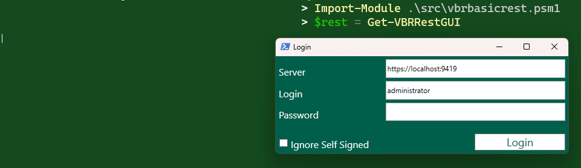
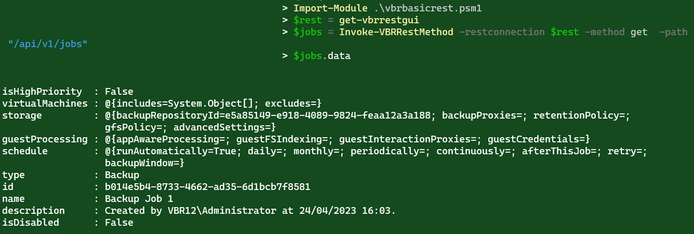
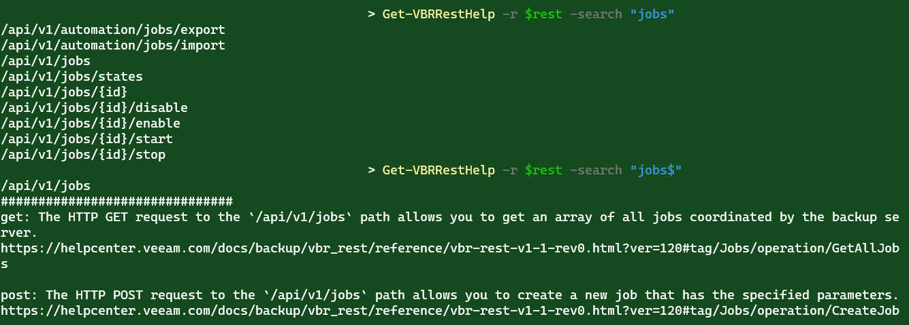

# vbreasyrest

Get started

```powershell
Import-Module .\vbrbasicrest.psm1
$rest = Get-VBRRestGUI
$jobs = Invoke-VBRRestMethod -restconnection $rest -method get  -path "/api/v1/jobs"
```




Get Help

```powershell
Get-VBRRestHelp -r $rest -search "jobs"
Get-VBRRestHelp -r $rest -search "jobs$"
```

